* Table of Contents
{:toc}
--------------------------------------------------------------------------------------------------------------------

## **Introduction**

tCheck is a desktop application that offers an integrated system to efficiently manage a bubble tea shop, of 
the (imaginary) brand T-sugar, by providing sales tracking, ingredients tracking and manpower management. It is 
optimised for the Command Line Interface (CLI), so that users can update and retrieve the information more efficiently.

### Purpose of Document
This document specifies the architecture and software design for the application, tCheck.

### Audience

The Developer Guide is designed for those who are interested in understanding the architecture and other aspects of software design
of tCheck. In particular, this guide has been written with the current and future tCheck developers in mind because it details
the knowledge necessary to modify the codebase and customize tCheck for specific operational needs or extend current functionalities.

--------------------------------------------------------------------------------------------------------------------

### **Setting up**

The code of tCheck is open sourced and published on a github repository. If you want to download the code and/or set up
an environment to contribute to this repository, you can refer to the guide [_Setting up and getting started_](SettingUp.md).

--------------------------------------------------------------------------------------------------------------------

## **Design**

### Architecture

The ***Architecture Diagram*** given above explains the high-level design of the App. Given below is a quick overview of each component.

:bulb: **Tip:** The `.puml` files used to create diagrams in this document can be found in the [diagrams](https://github.com/AY2021S1-CS2103T-T12-2/tp/tree/master/docs/diagrams) folder.

**`Main`** has two classes called [`Main`](https://github.com/AY2021S1-CS2103T-T12-2/tp/blob/master/src/main/java/seedu/address/Main.java) and [`MainApp`](https://github.com/AY2021S1-CS2103T-T12-2/tp/blob/master/src/main/java/seedu/address/MainApp.java). It is responsible for,
* At app launch: Initializes the components in the correct sequence, and connects them up with each other.
* At shut down: Shuts down the components and invokes cleanup methods where necessary.

[**`Commons`**](#common-classes) represents a collection of classes used by multiple other components.

The rest of the App consists of four components.

* [**`UI`**](#ui-component): The UI of the App.
* [**`Logic`**](#logic-component): The command executor.
* [**`Model`**](#model-component): Holds the data of the App in memory.
* [**`Storage`**](#storage-component): Reads data from, and writes data to, the hard disk.

Each of the four components,

* defines its *API* in an `interface` with the same name as the Component.
* exposes its functionality using a concrete `{Component Name}Manager` class (which implements the corresponding API `interface` mentioned in the previous point.

For example, the `Logic` component (see the class diagram given below) defines its API in the `Logic.java` interface and exposes its functionality using the `LogicManager.java` class which implements the `Logic` interface.

**How the architecture components interact with each other**

The *Sequence Diagram* below shows how the components interact with each other for the scenario where the user issues the command `c-delete 1`.

The sections below give more details of each component.

### UI component

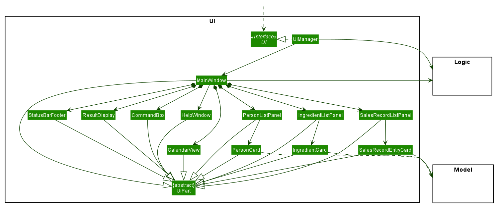

**API** :
[`Ui.java`](https://github.com/AY2021S1-CS2103T-T12-2/tp/blob/master/src/main/java/seedu/address/ui/Ui.java)

The UI consists of a `MainWindow` that is made up of parts e.g.`CommandBox`, `ResultDisplay`, `PersonListPanel
`, `IngredientListPanel`, `SalesRecordListPanel`, `CalendarView`, `StatusBarFooter` etc. All these, including the
 `MainWindow`, inherit from the abstract `UiPart` class.

The `UI` component uses JavaFx UI framework. The layout of these UI parts are defined in matching `.fxml` files that
are in the `src/main/resources/view` folder. For example, the layout of the
[`MainWindow`](https://github.com/AY2021S1-CS2103T-T12-2/tp/blob/master/src/main/java/seedu/address/ui/MainWindow.java)
is specified in [`MainWindow.fxml`](https://github.com/AY2021S1-CS2103T-T12-2/tp/blob/master/src/main/resources/view/MainWindow.fxml)

The `UI` component,

* Executes user commands using the `Logic` component.
* Listens for changes to `Model` data so that the UI can be updated with the modified data.

### Logic component

**API** :
[`Logic.java`](https://github.com/AY2021S1-CS2103T-T12-2/tp/blob/master/src/main/java/seedu/address/logic/Logic.java)

1. `Logic` uses the `TCheckParser` class to parse the user command.
1. This results in a `Command` object which is executed by the `LogicManager`.
1. The command execution can affect the `Model` (e.g. setting the ingredient's level of an ingredient).
1. The result of the command execution is encapsulated as a `CommandResult` object which is passed back to the `Ui`.
1. In addition, the `CommandResult` object can also instruct the `Ui` to perform certain actions, such as displaying 
the help window to the user.

Given below is the Sequence Diagram for interactions within the `Logic` component for the `execute("c-delete 1")` API call.

:information_source: **Note:** The lifeline for `DeleteCommandParser` should end at the destroy marker (X) but due to a limitation of PlantUML, the lifeline reaches the end of diagram.

### Model component

**API** : [`Model.java`](https://github.com/AY2021S1-CS2103T-T12-2/tp/blob/master/src/main/java/seedu/address/model/Model.java)

The `Model`,

* stores a `UserPref` object that represents the user’s preferences.
* stores the `Person`, `SalesRecordEntry` and `Ingredient` sub-components.
* does not depend on any of the other three components.

The `Person` sub-component,
* stores the address book data.
* exposes an unmodifiable `ObservableList<Person>` that can be 'observed' e.g. the UI can be bound to this list so that the UI automatically updates when the data in the list change.

:information_source: **Notes:**
    In tCheck context, an employee is modelled as a `Person`.

 

Given below is the class diagram showing details of the `Person` model

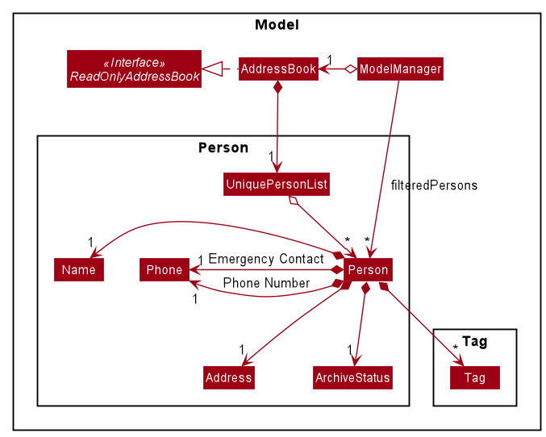

:information_source: **Notes:** An alternative (arguably, a more OOP
) model is given below. It has a `Tag` list in the `tCheck` application, which `Person` references. This allows
 `tCheck` to only require one `Tag` object per unique `Tag`, instead of each `Person` needing their own `Tag` object. 

 

The `SalesRecordEntry` sub-component,
* stores the sales book data
* exposes an unmodifiable `ObservableList<SalesRecordEntry>` that can be 'observed'. e.g. the UI can be bound to this
 list so that the UI automatically updates when the data in the list change.

Given below is the class diagram showing the details of the `SalesRecordEntry` model:

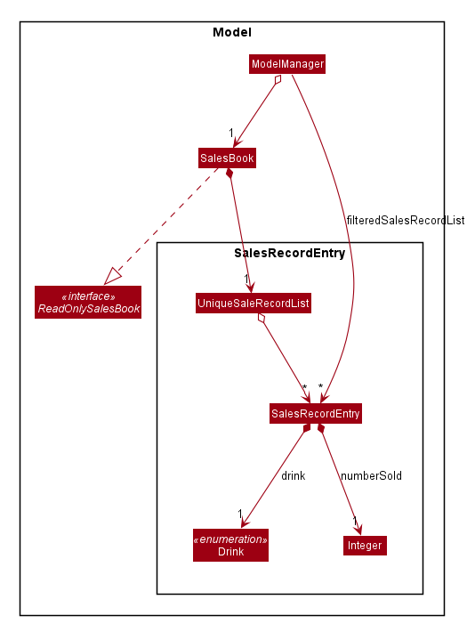

The `Ingredient` sub-component,
* stores the ingredient book data.
* exposes an unmodifiable `ObservableList<Ingredient>` that can be 'observed' e.g. the UI can be bound to this list so that the UI automatically updates when the data in the list change.

Given below is the class diagram showing details of the ingredient model:

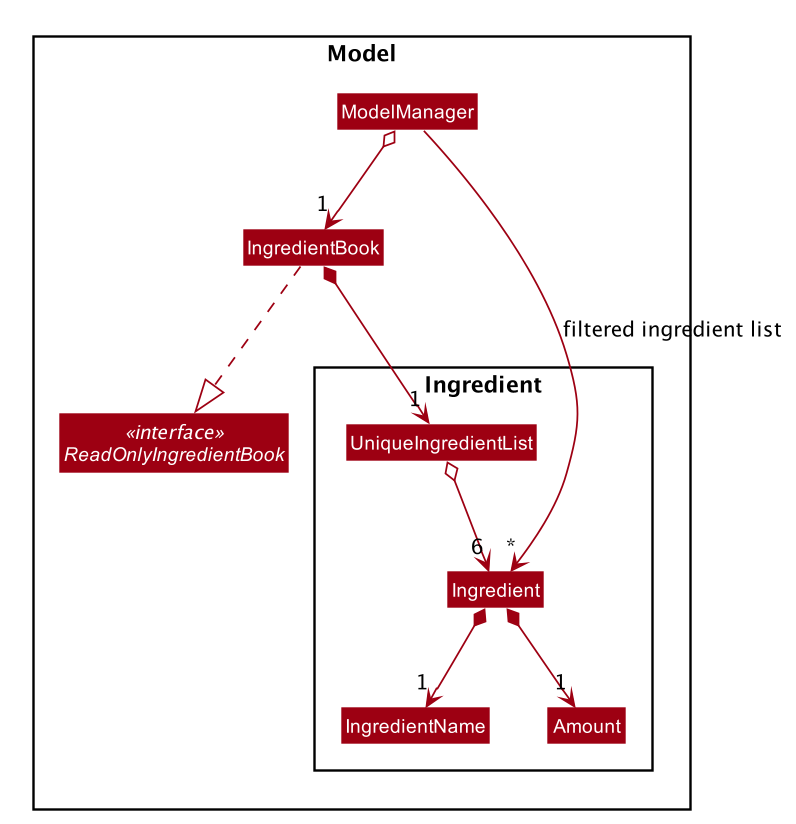

:information_source: **Notes on the class diagrams for the above 3 sub-components:** The text in the middle of the
 association arrows represents the role of the class at the arrow head. However, due to a limitation of
 PlantUML, where there cannot be two textboxes at the arrow head, the role has been placed in the middle of the arrow.

### Storage component

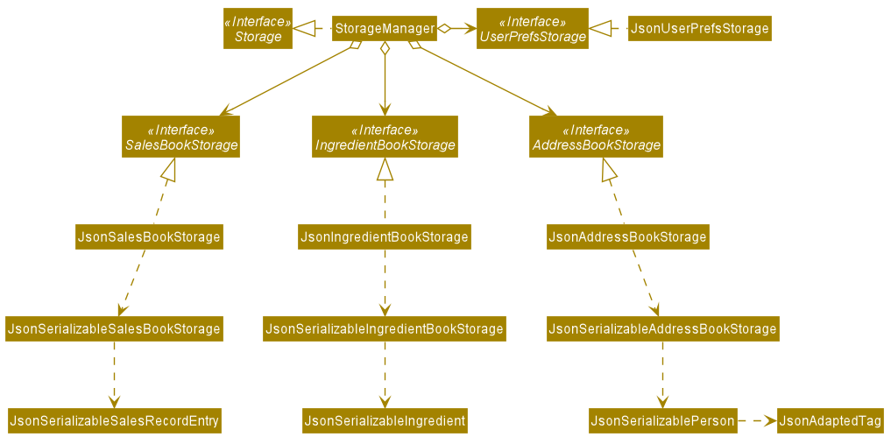

**API** : [`Storage.java`](https://github.com/AY2021S1-CS2103T-T12-2/tp/blob/master/src/main/java/seedu/address/storage/Storage.java)

The `Storage` component,
* can save `UserPref` objects in json format and read it back.
* can save the address book data in json format and read it back.
* can save the ingredient book data in json format and read it back.
* can save the sales book data in json format and read it back.

### Common classes

Classes used by multiple components are in the `seedu.addressbook.commons` package.

--------------------------------------------------------------------------------------------------------------------

## **Implementation**

This section describes some noteworthy details on how certain features are implemented.

### \[Completed\] Recording / Updating Sales Data

tCheck allows users to record and update the sales information on the drink sold. Such information is shown in the
 Sales Tracker in tCheck's user interface. The command to use this feature is:
`s-update DRINK [MORE_DRINKS]` where:
* `DRINK` is formatted as `A/NUM`.
    * `A` refers to the drink's abbreviation.
    * `NUM` refers to the number of drinks sold. It should be a **non-negative unsigned integer** that is 
less than or equal to 9,999,999.

The user may use this command for a single `Drink`, or multiple `Drink`s.

Currently, tCheck supports the tracking of 6 types of `Drink`s.
* `BSBM`  : Brown Sugar Boba Milk
* `BSBBT` : Brown Sugar Boba Black Tea
* `BSBGT` : Brown Sugar Boba Green Tea
* `BSPM`  : Brown Sugar Pearl Milk
* `BSPBT` : Brown Sugar Pearl Black Tea
* `BSPGT` : Brown Sugar Pearl Green Tea

#### Implementation

The completed mechanism to record the sales data is facilitated by the `SalesBook`. It implements the
`ReadOnlySalesBook` interface, which will allow the sales data to be displayed graphically in the user interface.
The sales data is stored in a `UniqueSalesRecordList`, which is a list of `SalesRecordEntry`. A `SalesRecordEntry`
contains the `numberSold` for a type of `Drink`. The `SalesBook` implements the following operation:

 * `SalesBook#overwriteSales(Map<Drink, Integer> sales)`  —  Overwrites the sales record with the given sales data

If the `SalesBook` is empty (i.e. no `SalesRecordEntry` is stored in the `UniqueSalesRecordList`), then
the using the `s-update` command will set the sales record with the user input. Drink items that were not provided in
 the user input will be set to a default value of 0.

Subsequent sales update will overwrite the existing sales record for the particular `Drink`.

This operation is exposed in the `Model` interface as `Model#overwrite(Map<Drink, Integer> salesInput)`.

Given below is an example usage scenario and how the recording sales data mechanism behaves at each step.

Step 1: The user launches the application for the first time. The `SalesBook` will be initialised with
 `SalesRecordEntries` for all `Drink`s with `numberSold` set to 0. The `SalesBook` is not empty.

Step 2: The user executes the `s-update BSBM/100 BSBGT/120` command to record that 100 Brown Sugar Boba Milk (BSBM) and
120 Brown Sugar Boba Green Tea (BSBGT) were sold. The `s-update` command calls 
`Model#overwrite(Map<Drink, Integer> salesInput)`, which will only overwrite the `numberSold` in the `SalesRecordEntry`
 for the `Drink` items that were given in the user input.
 
Step 3: The user realises that he left out some sales data. He executes the `s-update BSBBT/180 BSPM/64` command to
record that 180 Brown Sugar Boba Black Tea (BSBBT) and 64 Brown Sugar Pearl Milk (BSPM) were sold. A similar process
 as in Step 2 occurs when executing the `s-update` command.

A second usage scenario is given below, which shows how the mechanism behaves when the user has corrupted the data file
 for `SalesBook`: 

Step 1: The user corrupted the data file for `SalesBook` and caused previous records to be deleted. Now, the
 `SalesBook` is empty. 

Step 2: The user proceeds to execute the `s-update BSPM/30` command to record that 30 Brown Sugar Pearl Milk 
(BSPM) was sold. The `s-update` command will initialise the sales record in `SalesBook` when it is executed. 
This is because the current `SalesBook` is empty. It calls `Model#overwrite(Map<Drink, Integer> salesInput)`,
which will create new `SalesRecordEntries` and save the given sales data into the `UniqueSalesRecordList` in the
 `SalesBook`. The other `Drink` types which were not given in the input will be initialised to 0.

The following sequence diagram shows how the sales update operation works:

:information_source: **Notes:** The lifeline for `SalesUpdateCommand`
 and the `SalesUpdateCommandParser` should end at the destroy marker (X) but due to a limitation of PlantUML, the
  lifeline reaches the end of diagram.

The following activity diagram summarises what happens when a user executes the `s-update` command.

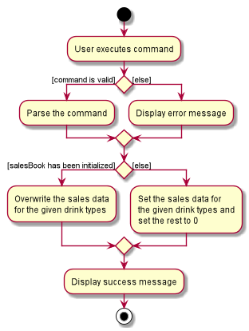

#### Design considerations:

##### Aspect: How the sales record updates
* **Alternative 1 (current choice)**: Overwrite the sales data only for the drink items specified by the
user in the `s-update` command
    *  Pros: More intuitive and convenient for the user. If the user made any error or miss out any details, he can
     correct the sales data with a shorter command.
    *  Cons: Less easy to implement.

* **Alternative 2**: Replace the sales record based on what has been given by the user, for every
  `s-update` command
    * Pros: Easy to implement.
    * Cons: May not be intuitive and convenient for the user, as the user would have to ensure that his command has
     no error and contains all information. If he made an error or left something out, he would have to retype the
      entire command again.

##### Aspect: How to implement `Drink` types
* **Alternative 1 (current choice)**: Implement `Drink` type as an Enumeration class
    * Pros: Simple to implement. Since there is only a fixed set of drink items to represent, we can use an enumeration
     class to represent the types of `Drink`s. It is also easier to add more types of drinks in the future.
    * Cons: If more functionalities are required from `Drink` in the future, then it may not be feasible to use an
     Enumeration class.
* **Alternative 2**: Implement `Drink` type as a normal class, where the fields could include a String to identify
 the type of Drink. The various Drink type would then inherit from this class.
    * Pros: It can can be extended more easily if there is a greater variety of drinks to store in the future.
    * Cons: There are not many operations to do with `Drink`s. It is only used to represent a constant set of
     drink types.

### \[Completed\] Finding sales data of some drinks

Finds specific drinks' sales data feature allows the user to get the sales data of a drink quickly. The command is:

* `s-find KEYWORD [MORE_KEYWORDS]` - Views sales data of drinks with the specified keywords.

#### Completed Implementation

The completed finds sales data of some drinks mechanism is facilitated by `InputContainsKeywordsPredicate`. It implements
Predicate<SalesRecordEntry>.

It exposes to `#Model updateFilteredSalesList(Predicate<SalesRecordEntry> predicate)`.

Given below is an example usage scenario and how the find drinks' sales data mechanism behaves at each step.

Step 1. The user launches the application. If the storage file for the sales book is empty, `SalesBook` will
be initialised with the six pre-defined drinks, namely `BSBM`, `BSBBT`, `BSBGT`, `BSPM`, `BSPBT` and `BSPGT`
with the sales data of 0 for all. If the storage file for the sales book is not empty, `SalesBook` will read the
data from the storage file.

Step 2. The user executes `s-find BSBBT` to view BSBBT's current sales data. The `s-find BSBBT` command is
parsed by `SalesFindCommandParser` which parses the input to get the matched drink's name and
returns an  `SalesFindCommand`,  which returns the drinks their sales data.

The following activity diagram shows how the find drink's sales data operation works:

#### Design consideration:

##### Aspect: How to find drink's sales data

  * **Current Choice**: Obtain the drink's name entered by the user, and use the
  drink's name to find the sales data by looping through the salesbook.
    * Pros: Code is more readable and consistent with the logic of finding employees.
    * Cons: Every execution of the command will require to access the sales record list loop through 
    the list once, which may increase the time required for the operation. 

### \[Completed\] Set ingredients' levels feature

The completed set ingredients' levels feature consists of three commands with slightly different command words and take in different numbers of parameters. The three commands complement one another, to provide a set of useful commands for enhanced user experiences in setting ingredients' levels. The three commands (including command word, prefix(es) if any and parameters taken in) are :

* `i-set i/INGREDIENT_NAME m/AMOUNT` — Sets the level of one specific ingredient to the specified amount.
* `i-set-default` — Sets the levels of all ingredients defined in the ingredient book to pre-determined amounts.
* `i-set-all M/AMOUNT_FOR_MILK P/AMOUNT_FOR_PEARL B/AMOUNT_FOR_BOBA L/AMOUNT_FOR_BLACK_TEA G/AMOUNT_FOR_GREEN_TEA S/AMOUNT_FOR_BROWN_SUGAR` — Sets the levels of all ingredients defined in the ingredient book to different specified amounts for each ingredient.

Note that because tCheck is designed for an imaginary bubble tea brand, T-Sugar, which produces all its drinks using six ingredients,
namely Milk, Pearl, Boba, Black Tea, Green Tea and Brown Sugar. All the six ingredients are pre-defined in tCheck's ingredient book. Only these six available ingredients' levels can be set using tCheck.

#### Implementation

The completed set ingredients' levels mechanism is facilitated by `IngredientBook`. It implements `ReadOnlyIngredientBook` interface and offers methods to set tCheck's `ingredientBook`. Particularly, it implements the following three operations:

* `IngredientBook#setIngredient(Ingredient target, Ingredient newAmount)` — Sets the amount the `target` ingredient in the ingredient book to the specified new amount.
* `IngredientBook#setIngredients(List<Ingredient> ingredients)` — Sets the amounts of all ingredients defined in the ingredient book according to the specified amounts in `ingredients` list.
* `IngredientBook#setIngredientsData(ReadOnlyIngredientBook newAmount)` — Sets the amounts of all ingredients defined in the ingredient book according to the `newAmount` ingredient book.

These operations are exposed in the `Model` interface as `Model#setIngredient(Ingredient target, Ingredient newAMount)` and `Model#setIngredientBook(ReadOnlyIngredientBook ingredientBook)` respectively.

:information_source: **Note:** The `IngredientBook#setIngredients(List<Ingredient> ingredients)` is not exposed in model because it is only used as a shortcut to change the internal states of `ReadOnlyIngredientBook ingredientBook` quickly.

Given below is an example usage scenario for the aforementioned three commands and how the mechanism behaves at each step for the commands.

Step 1. The user, a T-Sugar store manager, launches tCheck for the very first time. The `IngredientBook` will be initialized with a `UniqueIngredientList` containing the six pre-defined ingredients, namely `Milk`, `Pearl`, `Boba`, `Black Tea` , `Green Tea` and `Brown Sugar`, with an amount of 0 set for all.

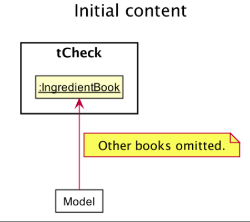

shows the relationship between Model and Ingredient Book after tCheck is launched.

Step 2. The user executes `i-set-default` to set the amounts of all ingredients to the default levels of the store, which are 50 L for liquids and 20 KG for solids. The `i-set-default` command calls `Model#setIngredientBook(ReadOnlyIngredientBook ingredientBook)`, causing the initial ingredient book to be replaced by the `ingredientBook` with the amounts of ingredients to be equal to the ingredients' default levels.

:information_source: **Note:** If the command fails its execution, it will not call `Model#setIngredientBook(ReadOnlyIngredientBook ingredientBook)`, so the ingredient book will not be changed in tCheck.

Step 3. The user finds that the real amounts for one particular ingredient in his/her store, milk for example, is different from the default level stored in tCheck and decides to set the amount for milk by executing the `i-set i/INGREDIENT_NAME m/AMOUNT` command. In this case, the exact command entered is : `i-set i/Milk m/100`.
The command calls `Model#setIngredient(Ingredient target, Ingredient newAmount)`, causing the `target`, which is `Milk`, in the current ingredient book to be replaced by `newAmount` with the same ingredient name `Milk` and updated amount, in this case `100` L.

:information_source: **Note:** If the command fails its execution, it will not call `Model#setIngredient(Ingredient target, Ingredient newAmount)`, so the ingredient book will not be modified in tCheck.

Step 4. After some time of operation, the user decides to update the ingredient book in tCheck with current amounts of ingredients in his/her T-Sugar store by executing the `i-set-all M/AMOUNT_FOR_MILK P/AMOUNT_FOR_PEARL B/AMOUNT_FOR_BOBA L/AMOUNT_FOR_BLACK_TEA G/AMOUNT_FOR_GREEN_TEA S/AMOUNT_FOR_BROWN_SUGAR` command.
In this case, the exact command entered is :  `i-set-all M/10 P/15 B/20 L/5 G/5 S/15`. The command calls `Model#setIngredient(ReadOnlyIngredientBook ingredientBook)`, causing the current ingredient book to be replaced by the `ingredientBook` with new different specified amounts for each ingredient.
Furthermore, 

The following sequence diagram shows how the set ingredients' levels operation works, using `i-set i/Milk m/100` as an example:

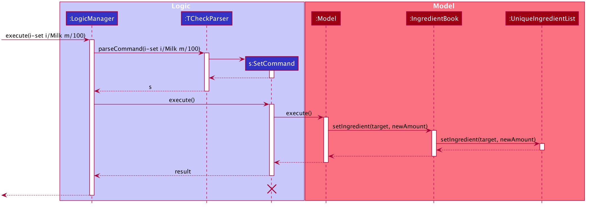

The following activity diagram summarizes what happens when a user executes a new command which is one of the three commands for setting ingredients' levels
Please note that only the command words of the respective commands are shown to represent the commands in this diagram:

#### Design consideration:

##### Aspect: How set ingredients' levels executes

* **Alternative 1 (current choice):** Differentiates into three commands to be able to set one single ingredient's amount, set all ingredients' amounts to default levels and set all ingredients' amounts to different levels.
  * Pros: Different commands can suit the needs of the user at different times. In the first few times of usage, the user is still not very familiar with the application and thus may only use `i-set-default` together with `i-set i/INGREDIENT m/AMOUNT` to make adjustments.
  When the user becomes an expert user, he/she can utilize the `i-set-all` command to complete the task of setting ingredients' levels with greater efficiency.
  * Cons: More implementation and testing work required to ensure all commands are working as expected.

* **Alternative 2:** Has only one command :  `i-set i/INGREDIENT_NAME m/AMOUNT`.

  * Pros: Easier to implement and test and thus less error-prone. Theoretically speaking, this one command can achieve the same effect as `i-set-default` and `i-set-all`  by entering it multiple times.
  * Cons: Does not really suit the user's needs because it can be tedious to set each ingredient individually.

### \[Completed\] Resetting all ingredients' levels feature

tCheck allows the user to reset the ingredient's levels of all ingredient types to zero. The command to use this 
feature is:
  
* `i-reset-all` — Resets the ingredient's levels of all ingredient types to zero.
  
#### Implementation
  
The completed mechanism to reset the ingredient's levels of all ingredient types to zero is facilitated by the 
`IngredientBook`. It implements the `ReadOnlyIngredientBook` interface, which will allow the ingredients to be 
displayed graphically in the user interface. The ingredients are stored in a `UniqueIngredientList`.
The `IngredientBook` implements the following operations:
  
  * `IngredientBook#getIngredientList()` — Returns the list of ingredients.
  * `IngredientBook#setIngredient(Ingredient target, Ingredient newAmount)` — Replaces the `target` ingredient 
  by the ingredient `newAmount`.
  
These operations are exposed in the `Model` interface as `Model#getFilteredIngredientList()` and 
`Model#setIngredient(Ingredient target, Ingredient newAmount)` respectively.

Given below is an example usage scenario that shows how the resetting all ingredients' levels mechanism behaves at 
each step.

Step 1. The user, a store manager of the bubble tea brand, T-Sugar, launches tCheck for the second time. 
The `IngredientBook` is loaded, containing data read from the `IngredientBook` data file. In this case,
The `UniqueIngredientList` in `IngredientBook` contains the six pre-defined ingredients, namely `Milk`, `Pearl`, 
`Boba`, `Black Tea` , `Green Tea` and `Brown Sugar`, with an amount of 0 for all ingredients except `Milk`, which 
has an amount of 5 in units of litres.

Step 2. The user executes the `i-reset-all` command to reset the ingredient's levels of all ingredient types to zero. 
The `i-reset-all` command calls `Model#getFilteredIngredientList()`, which returns the list of ingredients recorded by 
the `IngredientBook`. The `i-reset-all` command then checks the list of ingredients to see whether the ingredient's 
levels of all ingredient types are already zero before the `i-reset-all` command is going to make any change to 
the ingredients. Since all ingredients' levels are already zero except `Milk`, the `i-reset-all` command 
calls `Model#setIngredient(Ingredient target, Ingredient newAmount)`, causing the ingredient `target`, which is `Milk`, 
to be replaced by the ingredient `newAmount` which has the same ingredient name and a zero ingredient's level.

:information_source: **Notes:** If there are multiple ingredients that 
have nonzero ingredient's levels, `Model#setIngredient(Ingredient target, Ingredient newAmount)` will be called 
multiple times, each time replacing one of these ingredients with a new ingredient that has the same ingredient name and a zero 
ingredient's level.

The following sequence diagram shows how the resetting all ingredients' levels operation works, assuming that the 
`i-reset-all` command calls `Model#setIngredient(Ingredient target, Ingredient newAmount)` only once. This happens when 
only one ingredient has a nonzero ingredient's level before the execution of the `i-reset-all` command. 

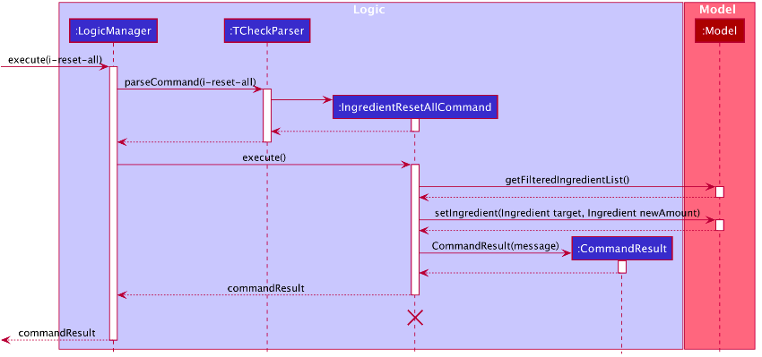

:information_source: **Notes:** The lifeline for 
`IngredientResetAllCommand` should end at the destroy marker (X) but due to a limitation of PlantUML, 
the lifeline reaches the end of diagram.

The following activity diagram summarises what happens when a user executes the `i-reset-all` command.
Note that as shown in the activity diagram, if the ingredient's levels of all ingredient types are zero 
before the execution of the `i-reset-all` command, an error message will be shown to the user.

#### Design considerations:

##### Aspect: How resetting all ingredients' levels executes
  
  * **Alternative 1 (current choice):** Loop through the list of ingredients twice, the first time to check if all 
  ingredients' levels are zero, the second time to replace each ingredient that has a nonzero ingredient's 
  level with a new ingredient which has the same ingredient name and a zero ingredient's level.
    * Pros: Easier to implement.
    * Cons: Execution of the command may require the creation of one or more new ingredients, which may increase the 
    time required for the operation.
    
  * **Alternative 2:** Loop through the list of ingredients twice, the first time to check if all ingredients' levels are 
  already zero, the second time to update the ingredient's level of the ingredients to zero if the ingredients 
  have nonzero ingredient's levels.
    * Pros: Clear implementation. Do not lead to creation of new ingredient objects.
    * Cons: Less easy to implement.

### \[Completed\] Archive employee(s) feature

When employees are no longer working in the store, their information would usually be deleted, or kept in
the archive. tCheck simulates this archive, storing these contact information in the app so that the user can still
retrieve them back when needed. For example, when an employee is rehired by the manager, the manager(user) can move
this specific employee's contact information back to the currently active contact information list from the
archived record.

The archiving employee feature consists of four commands with slightly different
formats, which complement one another, to provide a set of useful commands for enhanced user experiences. The four
commands are :

* `c-archive INDEX` — Archives the employee identified by the index number used in _Employee Directory_ pane.
* `c-unarchive INDEX` —  Unarchives the employee identified by the index number used in _Employee Directory_ pane.
* `c-archive-all` — Archives all employees in _Employee Directory_ pane.
* `c-archive-list` — Shows a list of all archived employees.

#### Implementation

In tCheck, each employee is modeled as `Person` object. The archiving employee feature is facilitated by the
 `ArchiveStatus` attribute of a `Person`. The following methods in the `Person` class and the `Model`interface
  facilitate this feature:

* `Person#archive()` — A method that sets the person's `ArchiveStatus` to `true`. It's equivalent to archive the person.
* `Person#unarchive()` — A method that sets the person's `ArchiveStatus` to `false`. It's equivalent to unarchive the
 person.
* `Model#PREDICATE_SHOW_ALL_ACTIVE_PERSONS` — A `Predicate` function that filters our archived persons from a given
 `PersonList`.
* `Model#PREDICATE_SHOW_ALL_ARCHIVED_PERSONS` — A `Predicate` function that filters our active(not archived
	) persons from a given `PersonList`.

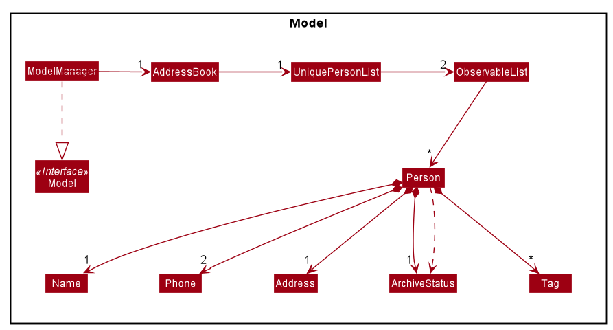

Given below shows how the `c-archive`, `c-unarchive`, and `c-archive-all` mechanism works in steps based on different scenarios. Two activity diagrams are provided before each detailed explanation to describe how tCheck handles an archiving/unarchiving commands. Three sequence diagrams are attached after the description

##### 1. Archive an employee
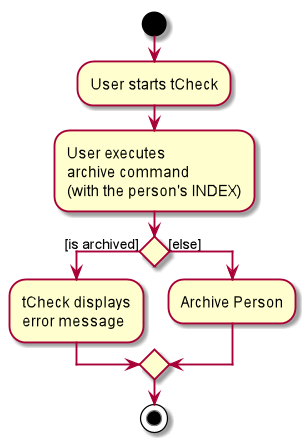

User can archive a specific employee (modeled as a `Person` in the code) by entering the `c-archive INDEX` command. The
 following steps describe how this behavior is implemented:

Step 1: The user archives a `Person` in the current observable `PersonList` with command `c-archive 1`. `ArchiveCommand` is created with the parsed arguments, and executed.

Step 2: The `Person` will then be checked if the `ArchiveStatus` is `true`. An error message will be displayed if the
 user tries to archive a person from the archived person list.
 
Step 3: The `Person` will have a new `ArchivedStatus` value, which will be set to `true` by using the `Person#archive()` method.

Step 4: The current `FilteredList` will be updated to only show active `Persons`, facilitated by the predicate `Model#PREDICATE_SHOW_ALL_ACTIVE_PERSONS`

:information_source: **Notes:** The lifeline for `ArchiveCommand`
 should end at the destroy marker (X) but due to a limitation of PlantUML, the lifeline reaches the end of diagram.

##### 2. Unarchive an employee

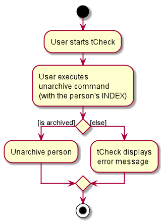

User can unarchive an already-archived employee(modeled as `Person` in the code) by entering the `c-unarchive INDEX
` command. The following steps describe how this behavior is implemented:

Step 1: The user unarchives a `Person` in the current observable `PersonList` with command `c-unarchive 1`. `UnarchiveCommand` is created with the parsed arguments, and executed.

Step 2: The `Person` will then be checked if the `ArchiveStatus` is `false`. An error message will be displayed if the user tries to unarchive a person from the active person list.

Step 3: The `Person` will have a new `ArchivedStatus` value, which will be set to `false` by using the `Person#unarchive()` method.

Step 4: The current `FilteredList` will be updated to only show active `Persons`, facilitated by the predicate `Model#PREDICATE_SHOW_ALL_ACTIVE_PERSONS`

:information_source: **Notes:** The lifeline for `UnarchiveCommand` should
 end at the destroy marker (X) but due to a limitation of PlantUML, the lifeline reaches the end of diagram.

##### 3. Archive all employees
User can archive all employees(employee is modeled as `Person` in the code) by entering the `c-archive-all` command. The
 following steps describe how this behavior is implemented:

Step 1: The user archives all `Person`s in the current observable `PersonList` with command `c-archive-all`. `ArchiveAllCommand` is created with the parsed arguments, and executed.

Step 2: For each `Person` in the observable 'PersonList', `ArchiveAllCommand` will create a `Person` object, and then set this `Person`'s `ArchiveStatus` to `true` by using the `Person#archive()` method.

Step 3: The current `FilteredList` will be updated to only show the empty active `Persons`, facilitated by the predicate `Model#PREDICATE_SHOW_ALL_ACTIVE_PERSONS`

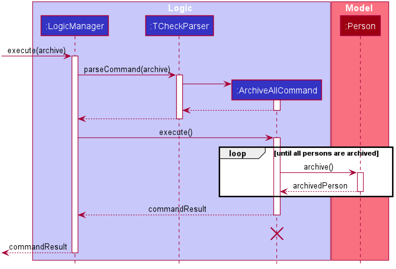

:information_source: **Notes:** The lifeline for 
`ArchiveAllCommand` should end at the destroy marker (X) but due to a limitation of PlantUML, the lifeline reaches
 the end of diagram.

#### Design considerations:

##### Aspect: The implementation to store archived employees

Notes: Employee is modeled as `Person` in the code.

* **Alternative 1 (current choice):** `Person` contains an `ArchiveStatus` field.

    * Pros: Easy to implement
    * Cons: If the `PersonList` contains a huge number of `Person`s, the processing speech will be slow for certain
      command (eg: c-archive-list), because it needs to go into each `Person` to check if the `ArchiveStatus` is `true`.

* **Alternative 2:** Storing archived employees in a separate json file.

  * Pros:  Execute `c-archive-list` very fast, even for huge amount of data, because it can just display all the data
   inside this file.
  * Cons: Hard to implement and maintain.

Alternative 1 was chosen, because for a bubble tea shop, normally the total number of employees will be less than 100.
And the software doesn't need to handle huge amount of data. On the other hand, if alternative 2 were
used, `Logic` and `Model` have to deal another set of data. Consequently, application's overall complexity will be
increased.

### \[Completed\] Edit employees's contact information feature

Compared with the original implementation, this feature adds emergency contact information of the employee. It can help
the user to contact some staff when emergency situation happens. The command is:

- `c-edit INDEX [n/NAME] [p/PHONE] [e/EMERGENCY_CONTACT] [t/TAG] ...`

#### Implementation

The completed edit employee's contact information is facilitated by `AddressBook`. It implements `ReadOnlyAddressBook`
interface and offers method to edit the application's `AddressBook`. Particularly, it changes Person's constructor and
function declarations to add emergency there.

Given below is an example usage scenario and how the edit mechanism behaves at each step.

Step 1: The user launches the application for the first time. Because now there isn't any information in addressbook.
The user can't edit now.

Step 2: The user executes `c-add n/Betsy Crowe e/81234567 p/91234567 t/morning shift t/part-time`. The `add` command calls
`Model#addPerson()` to add Besty's information in the `AddressBook`. The updated `AddressBook` is stored in
`addressbook.json`.

Step 3: The user executes `c-edit 1 n/Besty Crowe e/84749110 p/81234567 t/morning shift t/part-time` to change Besty Crowe's
phone number. This`edit` command calls `Model#setPerson()` to replace the original Besty Crowe's information in the
`Addressbook`, causing the updated `Addressbook` to be stored in `addressbook.json`, overwriting the former one.

#### Design Consideration

##### Aspect: How to display the emergency contact

* **Alternative 1 (current choice):** Displays the emergency contact of the similar format
with phone number, using a prefix to identify them.
  * Pros: Easy to implement.
  * Cons: May seem a little redundancy.
* **Alternative 2:** Use different icons to represent phone and emergency contact
  * Pros: Will be easy to tell from.
  * Cons: Need more work.

--------------------------------------------------------------------------------------------------------------------

## **Documentation, logging, testing, configuration, dev-ops**

* [Documentation guide](Documentation.md)
* [Testing guide](Testing.md)
* [Logging guide](Logging.md)
* [Configuration guide](Configuration.md)
* [DevOps guide](DevOps.md)

--------------------------------------------------------------------------------------------------------------------

## **Appendix: Requirements**

### Product scope

**Target user profile**:

* is the store manager of a milk tea shop of the (imaginary) brand T-sugar
* is very busy with daily operations and has little time for manual writing or recording
* is a fast typist
* has many part-time and full-time employees to manage
* needs to save all the employees’ contact numbers
* cares about the daily sales
* does an inventory check daily to ensure that ingredients are sufficient
  for the shop to operate smoothly
* needs to keep track of the daily sales
* prefers desktop apps over other types
* prefers typing to mouse interactions
* is reasonably comfortable using CLI apps

**Value proposition**:
The product provides an integrated system for the purpose of sales tracking, ingredients tracking and manpower
 management.

* To digitalise sales tracking and provide simple sales data analytics
    * Current Implementation at v1.4:
        * The product can keep a record of the number of each type of bubble tea sold.
        * The sales data can be analysed to give the user an insight of how the store is performing. This would allow 
          the user to see which kind of bubble tea sells better and consider adopting similar ideas when creating 
          new drinks.
            * This is currently done through the sorting function when listing sales.
    * Proposed added value for future implementations:
        * Given the number of each type of bubble tea sold, the product can provide the user with the revenue for each day.
        * The product can also help the user track the daily revenue changes, and the revenue for each
          type of bubble tea. This can also be analysed to give a better insight of the store's performance. 
        * The product integrates sales tracking and ingredient inventory tracking to provide the user with greater
          time saving. Given the number of each type of bubble tea sold, the user need not manually update the
          ingredient inventory as frequently, as the product can perform calculations to update them for the user.
* To digitalise ingredient inventory keeping
    * Current Implementation at v1.4:
        * The product can keep a record of the amount of ingredient remaining.
        * The product can remind the user when he needs to restock soon.
    * Proposed added value for future implementations:
        * The product will help to digitise inventory keeping, and thus help to save the user’s time and prevent 
          human error in calculation. It does not ensure that the employees use the same amount of ingredients in making 
          the drinks. The user only needs to enter the number of each type of bubble tea sold on the day. 
        * The product could also help the user calculate the total cost for restocking.
* To assist in manpower management
    * Current implementation at v1.4:
        * The product will provide a platform to allow the user to manage employees’ contact 
          information (e.g. contact number, emergency contact, address etc).
        * The product allows the user to find available manpower for specific days.

### User stories

Priorities: High (must have) - `* * *`, Medium (nice to have) - `* *`, Low (unlikely to have) - `*`

| Priority | As a/an…  | I can/I want to                                                  | So that I can/I want to                                                                |
| -------- | ------------| ---------------------------------------------------------------- | ----------------------------------------------------------------------------------- |
| `* * *`  | Store manager     | have a centralised system that helps me keep track of my employees’ contact details                                           | not need to organize working contacts on my personal phone|
| `* * *`  | Store manager         | have a software that helps me on inventory checking                                                | reduce the amount of human errors that may be involved and track the shop's inventory conveniently |
| `* * *`  | Store manager         | archive all employees' contact details with just one command   | quick-reset all the contact database without permanently deleting the information |
| `* * *`  | Store manager         | archive some employees' contact details   | retrieve them if needed in the future |
| `* * *`  | Busy store manager         | have a system that can automatically save the updated data after each command   | not need to click the save button every time and worry about data loss. |
| `* * *`  | First-time user        | be able to download this app                                                | play around and check out what it can be before actual usage  |
| `* * *`  | First-time user        | use the help feature                                          | get more familiar with the app features            |
| `* * *`    | First-time user        | find out if the app is running smoothly and bug-free        | decide if using this app will indeed help me run a store                    |
| `* * *`  | Concerned manager      | check the employee's contact number if they are absent without stating any reasons       | easily contact them in a short time  |
| `* * *`  | Second-time user      | initialize the ingredients level   | need not remember the amount of inventories, and only need to update when I do a restock |
| `* * *`  | Second-time user      | view all the ingredient levels from the last day   | restock before the ingredients ran out of stock and affect my business|
| `* * *`    | Second-time user      | find the emergency contacts of my employees quickly if they are injured | find the person to contact and know what action to take in the shortest time possible |
| `* * *`    | Second-time user      | set all different ingredients levels to standard default amounts   | easily start using tCheck to track ingredients in my store |
| `* * *`    | Second-time user      | set different ingredients levels to different default amounts   | be able to use tCheck to track my store's ingredients and their usage levels |
| `* * *`    | Intermediate user      | input the number of each type of drinks sold into tCheck at the end of the day | keep a record of the sales of the drinks |
| `* * *`    | Intermediate user      | find a specific ingredient consumption  | check an individual ingredient's level quickly   |
| `* * `    | Intermediate user      | see a ranking of the drinks sold | easily compare and identify the most popular drink in the shop so far   |
| `* * `    | Intermediate user      | view the list of drinks sold for the day | check that I have input the correct number and see a visual overview of the sales of drinks   |
| `* * `    | Store manager      | delete some of the employees' data who are no longer working at my shop | get them no longer tracked by tCheck   |
| `* * `    | Store manager      | see all archived contact details | still find my former employees' contacts when needed |
| `* * `    | Second-time user      | reset all ingredient levels to zero   | record new ingredient levels conveniently |

### Use cases

(For all use cases below, the **System** is the `tCheck` and the **Actor** is the `user`, unless specified otherwise)

**Use Case: UC01 - Archive an employee**

**MSS**

1. User archives an employee from employee directory. 
2. tCheck will move this corresponding employee into the archive and displays a success message.

     Use case ends.

**Extensions**

* 2a. tCheck detects an incorrect input format.

    * 2a1. tCheck requests the user to re-enter the data in the correct format.
    * 2a2. User enters new data.
  	
  	Steps 2a1-2a2 are repeated until the data entered is in the correct format.
    
    Use case resumes from step 2.
    
* 2b. tCheck detects that the specified employee does not exist.

    * 2b1. tCheck requests the user to re-enter a valid index that corresponds to an existing employee.
    * 2b2. User enters new index.
  	
  	Steps 2b1-2b2 are repeated until the index entered is valid.
    
    Use case resumes from step 2.
    
* 2c. tCheck detects that the specified employee has already been archived.

    * 2c1. tCheck returns the error message to the user.
    
    Use case ends.

**Use Case: UC02 - Archive all employees**

**MSS**

1. User archives all employees. 
2. tCheck will move all contact details into the archive and display a success message.

     Use case ends.

**Extensions**
* 2a. tCheck detects an incorrect input format.

    * 2a1. tCheck requests the user to re-enter in the correct format.
    * 2a2. User enters new data.
  	
  	Steps 2a1-2a2 are repeated until the data entered is in the correct format.
    
    Use case resumes from step 2.

* 2b. tCheck detects an empty Employee Directory.

    * 2b1. tCheck shows a warning message.
    
    Use case ends.

**UC03 - Set ingredient level for a single ingredient**

**MSS**

1. User chooses to set the ingredient level for an ingredient.
2. User enters the name of the ingredient and the amount he/she wants to set to.
3. tCheck will set the ingredient level of this ingredient and display a success message.

  Use case ends.

**Extensions**

* 2a. tCheck is unable to find the entered ingredient name.

  * 2a1. tCheck requests the user to re-enter the command with correct ingredient name.
  
  * 2a2. User enters a new ingredient name.
  
  Steps 2a1-2a2 are repeated until a valid ingredient name is entered.

  Use case ends.

* 2b. tCheck detects an invalid amount value entered.

  * 2b1. tCheck requests the user to re-enter the command with valid parameter for amount.
  
  * 2b2. User enters a new amount for the ingredient.
  
  Steps 2b1-2b2 are repeated until a valid amount is entered.

  Use case ends.

* 2c. tCheck detects missing field(s) in the command entered.

  * 2c1. tCheck requests the user to re-enter the command with all necessary fields.
  
  * 2c2. User enters new a command with necessary fields.
  
  Steps 2c1-2c2 are repeated until a valid command with all necessary fields is entered.

  Use case ends.

**UC04 - Set the sales volume for all types of drinks**

**MSS**

1. User chooses to set the sales volume for a type of drink.
2. tCheck requests for the drink name.
3. User enters the name of the drink.
4. tCheck requests for the number of that type of drink sold.
5. User enters the number of that type of drink sold.
6. tCheck sets the sales for this drink to the given number and displays a success message.
   Steps 1-6 are repeated until the sales of all types of drinks have been updated.

**Extensions**

* 3a. tCheck is unable to find the entered name.

    * 3a1. tCheck requests for the correct data.
    * 3a2. User enters new data. 
  	
  	Steps 3a1-3a2 are repeated until the data entered are correct.
    
    Use case resumes from step 4.
    
* 5a. tCheck detects an invalid sales number

    * 5a1. tCheck requests for the correct data.
    * 5a2. User enters new data.
  	
  	Steps 5a1-5a2 are repeated until the data entered are correct.
    
    Use case resumes from step 6.
      	
### Non-Functional Requirements

1.  Should work on any _mainstream OS_ as long as it has Java `11` or above installed.
2.  Should be able to hold up to 1000 employees without a noticeable sluggishness in performance for typical usage.
3.  Should be able to respond within 2 seconds for each operation.
4.  Should be able to function fully without access to internet.
5.  Should be for a single user.
6.  Data files should remain unchanged when transferring from one computer to another.
7.  Should not attempt to make any change in all data files.
8.  A user with above average typing speed for regular English text (i.e. not code, not system admin commands) should
 be able to accomplish most of the tasks faster using commands than using the mouse.
9.  A user without prior experience in inventory management system should be able to accomplish most of the tasks
 using commands. 

### Glossary

* **Mainstream OS**: Windows, Linux, Unix, OS-X
* **Store Manager**: A person who oversees the operation of a T-Sugar store, and is responsible for sales recording, inventory keeping and other management tasks of the store
* **Employee**: A person who works at a T-Sugar store and is either a full-time worker or a part-time worker
* **Address Book**: A list containing all the employees' details (name, phone number etc.)
* **Employee Directory**: A section of GUI which tracks the Address Book
* **Sales Book**: A list that stores sales data of the drinks
* **Sales Tracker**: A section of GUI which tracks the Sales Book
* **Ingredient Book**: A list that stores data of all available ingredients and their amounts
* **Ingredient Tracker**: A section of GUI which tracks the Ingredient Book

--------------------------------------------------------------------------------------------------------------------

## **Appendix: Instructions for manual testing**

Given below are instructions to test the app manually.

:information_source: **Notes:** These instructions only provide a
 starting point for testers to work on;
testers are expected to do more *exploratory* testing.

### Launch and shutdown

1. Initial launch

   1. Download the jar file and copy into an empty folder

   1. Double-click the jar file Expected: Shows the GUI with a set of sample employee data in the Employee Directory.
   The values in the Sales Tracker and Ingredient Tracker are initialised to 0. The window size may not be optimum.

1. Saving window preferences

   1. Resize the window to an optimum size. Move the window to a different location. Close the window.

   1. Re-launch the app by double-clicking the jar file. 
       Expected: The most recent window size and location is retained.

1. _{ more test cases …​ }_

### Adding an employee

1. Adding a new employee to the active Employee Directory

   1. Test case: `c-add n/John Doe p/98765432 e/87654321 a/311, Clementi Ave 2, #02-25 t/Friday t/monday` 
      Expected: An employee named John Doe should be added into the active Employee Directory with his phone number, emergency contact, address,
      and tags.

   1. Test case: `c-add` 
      Expected: No employee is added. Error details shown in the status message. Status bar remains the same.
      
### Deleting an employee

1. Deleting an employee while all active employees are being shown

   1. Prerequisites: List all active employees using the `c-active-list` command. Multiple employees in the list.

   1. Test case: `c-delete 1` 
      Expected: First employee is deleted from the active Employee Directory. Details of the deleted employee shown in the status message. Timestamp in the status bar is updated.

   1. Test case: `c-delete 0` 
      Expected: No employee is deleted. Error details shown in the status message. Status bar remains the same.

   1. Other incorrect delete commands to try: `c-delete`, `c-delete x`, `...` (where x is larger than the Employee Directory's size) 
      Expected: Similar to previous.

### Updating sales of drinks

1. Updating the sales of one and several drink items while all sales are being shown.

    1. Prerequisites: List all sales using the `s-list` command. The full list of drinks sales will be shown.
    
    1. Test case: `s-update BSBM/123`  
       Expected: The sales number for `BSBM` changes to 123. There is no order in this updated list of drink sales.
       
    1. Test case: `s-update BSBM/321 BSBBT/40 BSPM/988`  
       Expected: The sales number for `BSBM`, `BSBBT` and `BSPM` changes to 321, 40, and 988 respectively. There is no 
       order in this updated list of drink sales.
       
    1. Test case: `s-update BSBM/999999999999999`  
       Expected: No sales update is performed. An error message is shown in the Result Display. User is able to edit the
       input.
       
    1. Other incorrect `s-update` commands to try: `s-update`, `s-update AAAA/32`  
       Expected: Similar to previous.
       
### Listing sales of drinks in descending order

1. Listing the sales of a drink item after a sales update is performed.

    1. Prerequisite: Perform a sales update using the `s-update` command. The updated list of drink sales is not
     ordered.
     
    1. Test case: `s-list`  
       Expected: The list of drinks sales is now ordered from most to least number of sales.

### Finding sales of drinks

1. Finding the sales of a drink item while all sales are being shown.

   1. Prerequisites: List all sales using the `s-list` command. The full list of drinks sales will be shown.
   
   2. Test case: `s-find BSBBT` 
      Expected: BSBBT's sales data shown in the sales tracker panel.
      
   3. Test case: `s-find BSBBT BSBM` 
      Expected: BSBBT's sales data and BSBM's sales data shown in the sales tracker panel.
      
   4. Test case: `s-find HUGB` 
      Expected: No drink's sales data shown in the sales tracker panel.
   
   5. Test case: `s-find` 
      Expected: Error details shown in the status message. 
      
### Resetting all ingredients' levels to zero

1. Resetting all ingredients' levels to zero when not all ingredients have zero ingredient's levels

   1. Test case: `i-reset-all` 
      Expected: All ingredients' levels are now zero. A success message is shown in the _Result Display_.

1. Resetting all ingredients' levels to zero when all ingredients have zero ingredient's levels

   1. Test case: `i-reset-all` 
      Expected: All ingredients'levels are still zero. An error message is shown in the _Result Display_ explaining  
      that all ingredients' levels are already zero, before the execution of the `i-reset-all` command.

### Setting an ingredient's level to a specified amount

1. Setting an ingredient which is pre-defined in the ingredient book

   1. Prerequisites: The ingredient must be found from the displayed Ingredient Tracker section of the GUI. i.e. The ingredient is pre-defined in the ingredient book.

   1. Test case: `i-set i/Milk m/99` 
      Expected: (Given that the original amount for Milk is not 99 L) The amount for Milk is set to 99 L. Details of the new amount are shown in the success message in _Result Display_.

   1. Test case: `i-set i/milk m/99` 
      Expected: The amount of Milk is unchanged. Error message of ingredient not found is shown in _Result Display_.

   1. Test case: `i-set i/Milk m/-99` 
      Expected: The amount of Milk is unchanged. Error message of invalid amount is shown in _Result Display_.

   1. Other incorrect set commands to try: `i-set i/Milk m/1.2`, `i-set i/Milk m/1000`, `i-set i/Milk` 
      Expected: The amount of milk is unchanged. Corresponding error messages are shown in _Result Display_.

### Archiving an employee

1. Archiving an employee and hides his/her info from the active/unarchived employee directory.

   1. Prerequisites: List all active(unarchived) employees using the `c-active-list` command. Multiple
    unarchived employees in the employee directory. The following test cases assumes the commands are run on
    unmodified sample data.

   1. Test case: `c-archive 1` 
      Expected: First employee is archived from the list. Details of the archived contact shown in the status message.

   1. Test case: `c-archive 0` 
      Expected: No employee is archived. Error details shown in the status message.

   1. Other incorrect archive commands to try: `archive`, `c-archive x`, `...` (where x is larger than the list size
   ) 
      Expected: No employee is archived. Error details shown in the status message.

### Saving data

1. Dealing with missing data files

   1. Prerequisites: The `addressbook.json`, `ingredientbook.json` and `salesbook.json` files exist in the data
    folder inside the home folder of tCheck. tCheck is able to launch with no error. Close the application before
     testing.
   
   1. Test case: Delete the `addressbook.json` file in the data folder.  
      Expected: The application launches normally. The employees in the Employee Directory are created using data from a
       sample AddressBook.
       
   1. Test case: Delete `ingredientbook.json` file in the data folder.  
      Expected: The application launches normally. All ingredients' levels in the Ingredients Tracker will be
       initialised to 0.
       
   1. Test case: Delete `salesbook.json` file in the data folder.  
      Expected: The application starts normally. All sales records' sales level in the Sales Tracker will be
      initialised to 0.

1. Dealing with corrupted data files

    1. Prerequisites: The `addressbook.json`, `ingredientbook.json` and `salesbook.json` files exist in the data
           folder inside the home folder of tCheck. tCheck is able to launch with no error. Close the application before
           testing.
           
    1. Test case: Add invalid syntax in the `addressbook.json` file in the data folder. Eg. Add "xxx" to the end of a
       phone number  
       Expected: The application launches normally with no data present in all three sections - Sales Tracker
       , Ingredients Tracker and Employee Directory.
       
    1. Other test cases to try: corrupt the `ingredientsbook.json` or `salesbook.json` in a similar way using the
     previous test case.
     Expected: Similar to previous.
